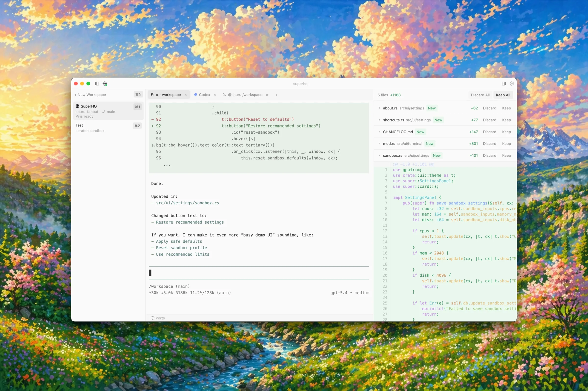

# SuperHQ

A sandboxed AI agent orchestration platform built with Rust and [GPUI](https://gpui.rs). Run multiple AI coding agents (Claude Code, Codex, etc.) in isolated sandbox environments with full terminal access.

> **Warning:** This is a very early alpha. Expect rough edges, missing features, and breaking changes. Not ready for production use.



## Install

```bash
brew tap superhq-ai/tap && brew install --cask superhq
```

Or download the latest `.dmg` from the [Releases](https://github.com/superhq-ai/superhq/releases) page.

> **macOS Gatekeeper:** Since the app is not notarized, macOS will block it on first launch.
> Open **System Settings > Privacy & Security**, scroll down, and click **"Open Anyway"** next to the SuperHQ message.

### Requirements

- macOS 14+ (Apple Silicon)
- ~500 MB disk space for the Shuru runtime (downloaded on first launch)

## Supported Agents

| Agent | Auth | Notes |
|-------|------|-------|
| **Claude Code** | Anthropic API key | Installed automatically via npm |
| **OpenAI Codex** | OpenAI API key, OpenRouter API key, or ChatGPT Plus/Pro subscription (OAuth) | OpenAI/OAuth use the auth gateway; if `OPENROUTER_API_KEY` is set, Codex routes through OpenRouter |
| **Pi** | Anthropic API key and/or OpenAI API key (or ChatGPT Plus/Pro via OAuth) | At least one provider required. OpenAI models routed through auth gateway |

## Security Model

Agents run inside sandboxed VMs and **never see your real API keys**. SuperHQ uses an **auth gateway** — a reverse proxy on the host that injects credentials into outgoing API requests without exposing them to the sandbox.

For Codex with OAuth, the gateway handles token refresh and forwards authenticated requests to `chatgpt.com/backend-api/codex` — so your ChatGPT Plus/Pro subscription works out of the box.

## Features

- **Sandboxed workspaces** — each workspace runs in an isolated VM with its own filesystem, networking, and resource limits
- **Multiple agents** — run Claude Code, OpenAI Codex, and custom agents side-by-side
- **Secure auth gateway** — agents never see real API keys or OAuth tokens
- **Port management** — forward sandbox ports to host, expose host ports to sandboxes
- **Review panel** — see file changes made by agents with unified diff view
- **Keyboard-first navigation** — fast workspace/tab switching with shortcuts

## Keyboard Shortcuts

### Workspaces

| Action | Shortcut |
|--------|----------|
| New workspace | `Cmd+N` |
| Switch workspace 1-9 | `Cmd+1` - `Cmd+9` |
| Next workspace | `Ctrl+Cmd+]` |
| Previous workspace | `Ctrl+Cmd+[` |

### Tabs

| Action | Shortcut |
|--------|----------|
| New agent tab | `Cmd+T` |
| Close tab | `Cmd+W` |
| Switch tab 1-9 | `Ctrl+1` - `Ctrl+9` |
| Next tab | `Cmd+Shift+]` |
| Previous tab | `Cmd+Shift+[` |

### App

| Action | Shortcut |
|--------|----------|
| Settings | `Cmd+,` |
| Toggle review panel | `Cmd+B` |
| Ports | `Cmd+Shift+P` |

Hold `Cmd` to see workspace shortcut badges. Hold `Ctrl` to see tab badges.

## Building from source

Requires the [shuru SDK](https://github.com/superhq-ai/shuru) cloned as a sibling directory:

```sh
git clone https://github.com/superhq-ai/shuru.git ../shuru
cargo build --release
```

### Package as macOS app

```sh
./scripts/package.sh
# Output: target/SuperHQ-<version>.dmg
```

## Architecture

- **GPUI** — GPU-accelerated UI framework (from Zed editor)
- **shuru-sdk** — sandboxed VM orchestration (boot, exec, filesystem, networking)
- **SQLite** — workspace config, secrets (AES-256-GCM encrypted), port mappings
- **Auth gateway** — reverse proxy that injects API credentials without exposing them to sandboxes

## Star History

<a href="https://www.star-history.com/?repos=superhq-ai%2Fsuperhq&type=date&legend=top-left">
 <picture>
   <source media="(prefers-color-scheme: dark)" srcset="https://api.star-history.com/chart?repos=superhq-ai/superhq&type=date&theme=dark&legend=top-left" />
   <source media="(prefers-color-scheme: light)" srcset="https://api.star-history.com/chart?repos=superhq-ai/superhq&type=date&legend=top-left" />
   
 </picture>
</a>

## License

[GNU Affero General Public License v3.0](LICENSE)
